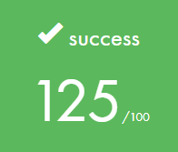
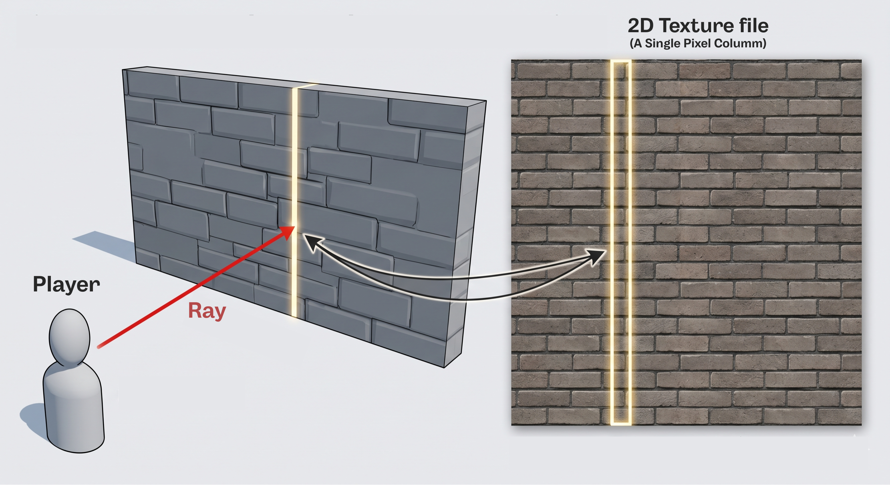
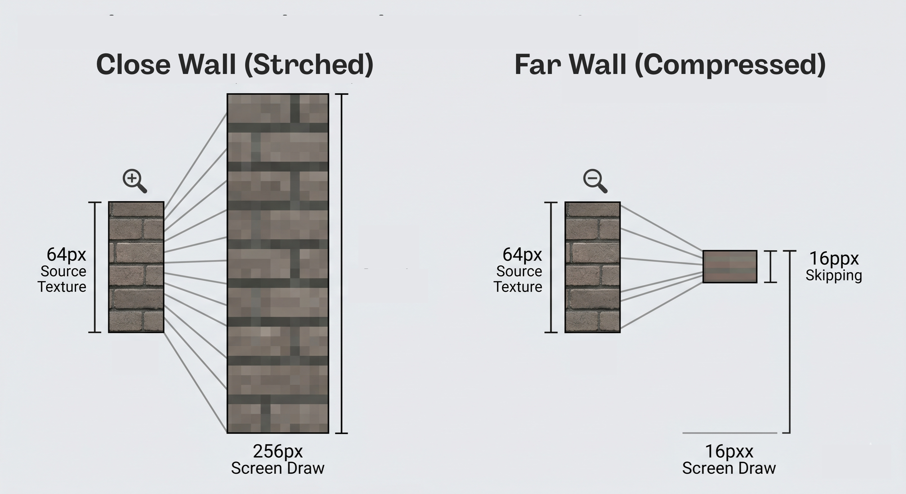
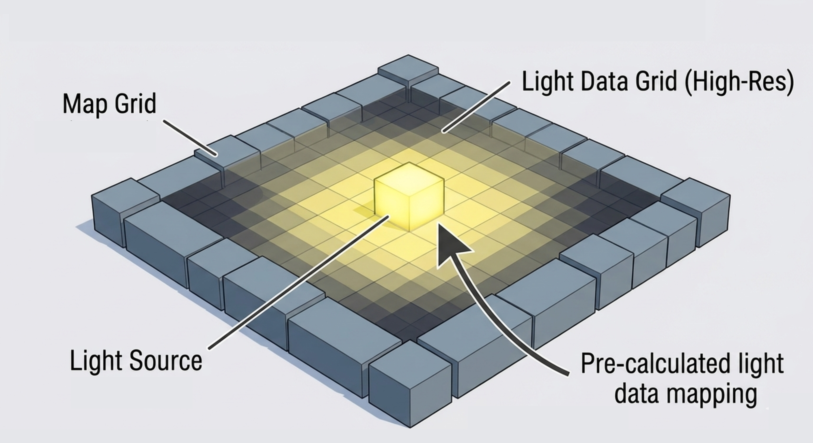
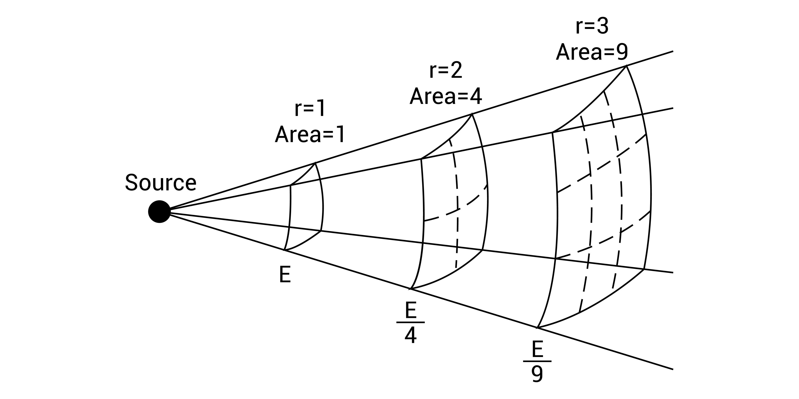
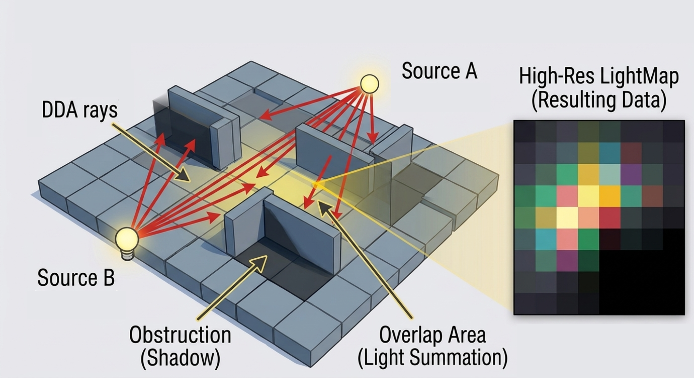
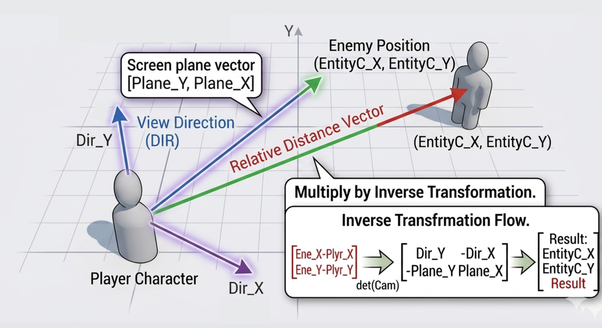
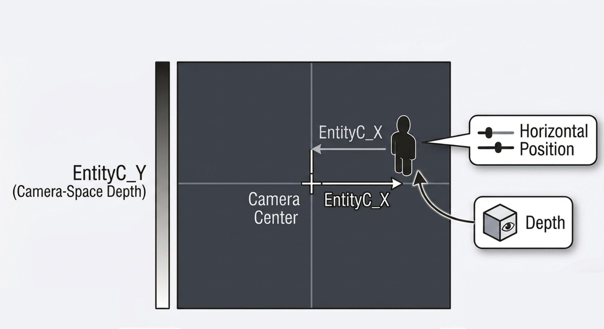
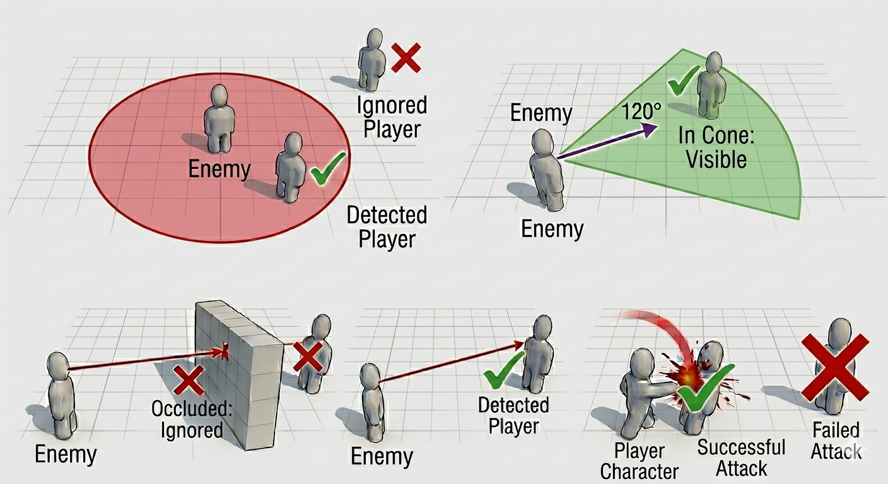
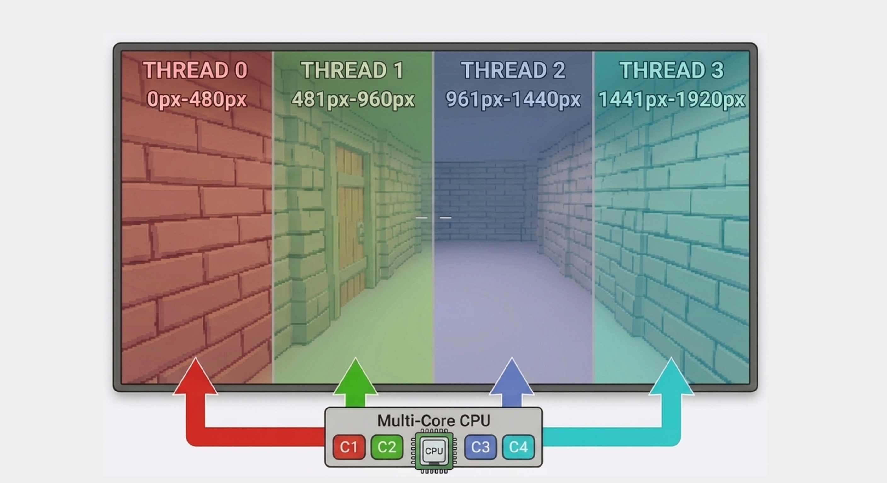

# 🎮 Cub3d: Raycasting Rendering Engine

## 📖 Description

Cub3d is a first-person maze exploration engine built from scratch and inspired by the classic 1992 game Wolfenstein 3D. More than just moving a character across a screen, this project is a deep dive into the mathematical foundations of computer graphics, linear algebra (vectors and matrices), and C optimization using multithreading.

> **In simple terms: this program cleverly tricks us.** The entire game happens and is calculated on a completely flat map (a 2D grid). However, by using geometric projections and math-based gameplay mechanics, we can create the illusion of a fully immersive and playable 3D world on your monitor.

<p align="center">  </p>

---

## 📐 Math Fundamentals and Core Architecture

To understand how we turn a flat grid viewed from above into a 3D perspective, we will build the concepts step by step; analyzing everything from how the player moves to how we simulate ray impacts or shadows on nearby cells.

### 🎥 1. The Player: Camera and Movement System

#### Orientation System
In this world, the player can't just be defined by a single point or `(X, Y)` coordinate. To simulate what the player sees and where they are looking, we need to build a "camera". The camera mainly consists of 3 vectors:

- **Position Vector ($P$)**: The player's actual coordinates on the map, `(Px, Py)`.
- **Direction Vector ($D$)**: An invisible arrow pointing straight out from our "nose", creating a line right in front of us, `(Dx, Dy)`.
- **Camera (or Projection) Plane ($C$)**: `(Cx, Cy)`. A horizontal line perpendicular to our Direction, which limits our "Field of View" (FOV). A wider FOV gives more peripheral vision; a narrower one is more focused.

```text
                                    Camera Plane (C)
                                    +--------+--------+
                                     \       |       /
                                      \      |      /
                                       \     |     /   Ray(x)
                                        \    |    /
                                         \   |   /  Direction (D)
                                          \  |  /
                                           \ | /
                                            \|/
                                          Player (P)
```

When you move your mouse side to side, the 3D environment doesn't actually move. What we are doing is "rotating" the 2D camera. But spinning both vectors (the Direction $\vec{D}$ and the Plane $\vec{C}$) isn't as simple as just adding a number; it requires trigonometry.

To rotate a vector by any angle $\theta$, we use the famous **2D Rotation Matrix**. We get the sine and cosine of the angle we want to turn to and mathematically recalculate the new `X` and `Y` positions:

$$
\begin{bmatrix} X' \\ Y' \end{bmatrix} = \begin{bmatrix} \cos\theta & -\sin\theta \\ \sin\theta & \cos\theta \end{bmatrix} \begin{bmatrix} X \\ Y \end{bmatrix}
$$

When looking around, we multiply our $D$ and $C$ vectors this way to ensure they rotate together perfectly and stay in a strict perpendicular cross shape. *(If you want to understand how mathematical rotation matrices are built from scratch, I invite you to read my [FdF](https://github.com/LordMikkel/Fdf) project where I explain it in detail).*

---

### 🗺️ 2. Optical Projection of the Map in 3D

The game is designed for a target resolution, like 1920 pixels wide. This means that dozens of times a second, our engine shoots 1920 **virtual rays** horizontally across your monitor to scan the 3D world. We use these rays to calculate distances and figure out exactly where to draw walls or objects on the screen.

#### The DDA (Digital Differential Analyzer) Algorithm
If each ray moved slowly forward "millimeter by millimeter" looking for a solid block, the game would run incredibly slow. Instead, the DDA algorithm smartly skips from grid intersection to grid intersection inside the map.

The algorithm takes a shortcut by asking: *"From where the ray is right now, which grid line is closer to cross: a vertical one (X-axis) or a horizontal one (Y-axis)?"* It moves freely through empty spaces until it hits a solid obstacle.

```text
                                     +---+---+---+---+
                                     |   |   |   |[X]| <-- Wall hit!
                                     +---+---+---/---+
                                     |   |   | / |   |
                                     +---+---/---+---+
                                     |   | / |   |   |
                                     +---/---+---+---+
                                       P(Player)
```

#### Distortion and Perpendicular Distance

We use basic geometry: if a calculated wall is *twice as far away*, it will be drawn *half the size* on the screen.

However, rays shot toward the edges of the screen travel an obviously longer diagonal path than the ray shooting straight out of the center. If we used that "total traveled distance," the image on the screen edges would warp, looking like a rounded "fish-eye" lens.

We fix this by using "perpendicular distance." This means we only calculate the straight, shortest distance from our camera's horizontal plane forward to the wall.

```text
                     [Wall]===================================
                                 \               |
                      Euclidean   \              | Perpendicular
                       Distance    \             |   Distance
                        (Warped)    \            |  (Correct)
                                     \           |
                                      \          |
                                       \         |
                                        \        |
                                      (P) [Player Camera]
```

Once we have the exact perpendicular distance, we project how tall (in pixels) the vertical strip of the wall should be. Using basic perspective rules, height is inversely proportional:

$$
h_{projected} = \frac{h_{screen}}{d_{perpendicular}}
$$

Knowing the vertical column's exact height (for example, about 400 pixels tall) and its exact position between the ceiling and floor, we just have to color it.

#### Advanced Texture Mapping
To paint the wall, we go down that vertical strip pixel by pixel, taking the exact matching color from our 2D image file (`.png`) and embedding it onto the window:



1. **Horizontal (X) Texture Point**:
When the ray hits a wall, we find the exact impact point. By using the mathematical modulo (or remainder) operation, we figure out which vertical slice of our original 2D image matches that hit location. This tells us what pixel column of the original texture we need.

2. **Vertical (Y) Position**: As we draw the wall top-to-bottom on the screen, we progress pixel-by-pixel smoothly through the original image. If the wall is very far away (drawn small), we take larger "skips" in the original texture to compress it; if it's very close (drawn huge), we step forward very slowly, sometimes repeating pixels, to stretch the image exactly right.



---

### 💡 Lighting

To make the environment look less artificial, we set up a pre-calculated lighting system. Based on where the map's light sources are, it generates a grid showing how much light reaches every sub-cell of the map. This lets us have lighting without heavily hurting game performance.



#### The Inverse-Square Law of Light
In real life, imagine lighting a match. Its light initially expands like an invisible balloon around the flame. As that sphere of light gets larger, the light has to cover much more space, so its brightness heavily decreases.



In physics, this dictates that light intensity drops off aggressively, proportional to the "inverse square of the distance". If you move twice as far away, the light you see will be four times less bright.

We added a small factor `$k$` and adjusted a $1.0$ so that the intensity does not cause technical failures (divisions by zero).

$$
I_{received} = \frac{I_0}{1.0 + k \cdot d^2}
$$


#### LightMap
To store the lighting data, we create a matrix (grid) similar to the map itself but with much higher definition (more subdivisions per cell). For every light source, we use DDA rays again to track obstructions. We also add up the intensities in areas where multiple lights shine on the same spot.



---

### 👾 3. Artificial Intelligence and Sprites

Weapons, collectibles, and enemies are not fully 3D models; they are flat 2D images (sprites) pasted onto the screen. Since they don't have volume, they don't physically interact with the 3D world in the same way. Instead, the graphics engine creates an illusion of depth by calculating exactly where they should be drawn relative to the player.

#### Inverse Transformation (Relative Position)
The goal here is to answer a key question: *"Where on the 2D screen, and how big, should I draw this image so it looks like it belongs in the 3D world?"*.

We break this calculation down into steps:[text](about:blank#blocked)

1. **Relative Distance:** First, we calculate the vector aiming from the player to the enemy (by subtracting their coordinates).
2. **Camera Translation:** That vector tells us the enemy's global position relative to the player, but we need to know where it is from the perspective of the player's *gaze*. To "translate" these global coordinates into the camera's view, we multiply the vector by the **inverse camera matrix**:

$$
\begin{bmatrix} EntityC_X \\ EntityC_Y \end{bmatrix} = \frac{1}{Det(Cam)} \begin{bmatrix} Dir_Y & -Dir_X \\ -Plane_Y & Plane_X \end{bmatrix} \begin{bmatrix} Ene_X - Plyr_X \\ Ene_Y - Plyr_Y \end{bmatrix}
$$



3. **Perspective Division (Depth):** With this relative coordinate in hand, the final step is to divide it by its "depth" value (how far away the enemy is from the camera plane). This does two vital things:
    * It figures out the specific horizontal pixel (X-axis) where the center of the sprite should be drawn.
    * It lets us scale the image: the higher the depth (the farther away it is), the smaller the enemy will be drawn, giving a realistic sense of distance.



#### Directional Sprite Animation
To prevent the enemy from looking like a frozen image sliding around, the game needs to know which exact drawing to show (front, back, left profile, right profile) based on how the enemy is turned relative to us. We figure this out using two core vector math operations:

*   **Dot Product:** Tells us if two vectors point in the same or opposite directions. We use this to quickly know if the enemy is looking at us (facing us) or showing us its back.
*   **Cross Product:** Tells us the lateral turning direction. It reveals if the enemy is facing toward our left or our right side.

```text
                                            Blind Spot
                                    ..........................
                                    :                        :
                                    :         [ENEMY]        :
                                    :          / | \         :
                                     .       /   |   \      .
                                       .   /     |     \  .
                                         /       |       \
                                       /   120° FOV Cone   \
                                     /           |           \
                                               [PLAYER]
```


By combining both calculations, the game knows the exact relative angle of the enemy and automatically picks the right drawing frame. This delivers smooth immersion as we move. Using a state machine, the logic loops between sprites to show different movement steps and animations.

---

### 🎯 4. Gameplay Mechanics and Dynamic Hitboxes

#### Enemy Vision Logic
If every enemy on the map was always shooting precision tracking beams (RayCasting) out to find the player, the game's performance would tank. To save CPU power, AI "vision" passes through 3 filters. If the player breaks any of the filters, the enemy immediately skips the rest:

1. **Distance Filter (Pythagorean Theorem):** An extremely cheap check for the CPU. We calculate the squared distance ($DX^2 + DY^2 < \text{Limit}$). If the player is too far away or on the other side of the map, the enemy simply ignores all subsequent checks.
2. **Field of View (120°):** No creature has 360-degree vision. Using the dot product, we verify if the player sits within the enemy's front visual cone (around 120°). If you sneak up from their back or blind spots, the enemy won't see you, making stealth approaches possible.
3. **Line of Sight (DDA RayCast):** If you are close and standing right in front of the enemy, the final, most expensive check runs: an invisible ray is fired from the enemy out to you. If it hits a wall or closed door, the AI assumes you are hiding and skips the attack sequence.
4. **Attack:** If the enemy gets close enough, it triggers its attack animation in an attempt to hit you and reduce your health. Whether it succeeds depends on how close and aligned it is with you.



#### HitScan
Bullets aren't treated as a single strict point on impact; the logic bends mechanically.

To figure out if you hit your shot, the game uses an "impact funnel". It works like this:
*   **Close Range:** The hit cone is tight. If you are extremely close, you have to aim precisely.
*   **Long Range:** As the enemy gets further away (and its sprite shape becomes tiny on screen), the game gets more forgiving and opens the angle of the cone wider.

This flexibility is calculated with a formula loosely based on: $Impact > Limit \times Distance^{2}$. This completely balances out the lack of precision you usually have in a grid-based 3D environment.[text](about:blank#blocked)

---

### ⚡ 5. Multithreading and Parallelization

Shooting nearly 2,000 rays and painting them every frame forces the CPU to run millions of sequential calculations rapidly. That's why I implemented multithreading to run these graphic processes simultaneously, fully utilizing the CPU if it has multiple computer cores.

It's fairly straightforward: The program counts how many "cores" your CPU has. If you have 4 cores, it divides the screen width into 4 equal vertical sections, and draws them all at the exact same time using C `pthreads`. Since none of these screen segments need to share information with each other, the isolated threads run happily without slow mutex locks to complicate everything.



---

## 🕹️ Instructions

### Compilation
To compile the game:
```bash
make
```

### Run and Play
Simply run the executable along with the map file you want:
```bash
./cub3d map/hospital.cub
```

### Controls
- <kbd>W</kbd> <kbd>A</kbd> <kbd>S</kbd> <kbd>D</kbd> : Walk around the map.
- <kbd>Shift</kbd> + <kbd>W</kbd> <kbd>A</kbd> <kbd>S</kbd> <kbd>D</kbd> : Run.
- <kbd>←</kbd> <kbd>→</kbd> or **Mouse Movement** : Rotate camera.
- <kbd>Left Click</kbd> : Aim the weapon.
- <kbd>Right Click</kbd> : Fire weapon or melee attack.
- <kbd>E</kbd> : Interact with doors.
- <kbd>Space</kbd> : Jump.
- <kbd>ESC</kbd> : Exit the program.


## 📚 Resources
- [Lode's Computer Graphics Tutorial (Raycasting)](https://lodev.org/cgtutor/raycasting.html) - An incredible essential guide all about raycasting math and DDA grids.
- [Why Wolfenstein Was Way Ahead of It’s Time](https://www.youtube.com/watch?v=rPn_LKUJ7II) - Informative breakdown about the video game that paved the way for these exact graphical routines.
- [Wolfenstein 3D Source Code](https://github.com/id-Software/wolf3d) - The original C source code repository for 1992's Wolfenstein.
- [MLX42 Documentation](https://github.com/codam-coding-college/MLX42) - Comprehensive documentation over the cross-platform library we used to draw pixels.
- [Generative Artificial Intelligence](https://gemini.google.com) - AI models were heavily used to construct the game's visuals/textures and as a vital tool to refine algorithm math for better rendering performance. It also helped clean and polish the math explanations seen in this documentation.

---

## ✍️ Credits

I am Mikel Garrido, a student at 42 Barcelona. I always try to build the simplest yet most robust implementations in all my projects. I hope this guide has been helpful to you!

[](https://profile.intra.42.fr/users/migarrid)
